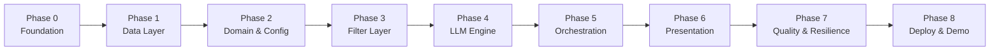
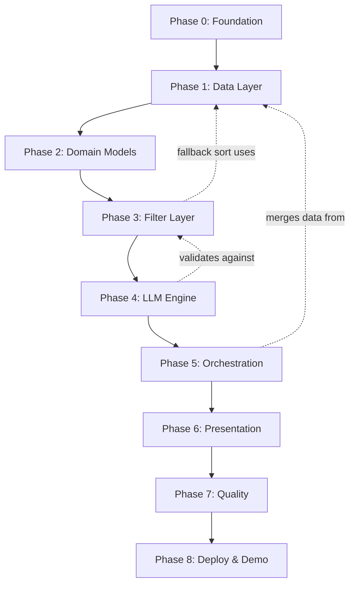

# Phase-Wise Implementation Plan

**Project:** AI-Powered Restaurant Recommendation System (Zomato Use Case)  
**Based on:** `ARCHITECTURE.md`, `context.md`, `PROBLEMSTATEMENT.TXT`  
**Version:** 1.2  
**Stack (milestone):** Technology Options — **Option A** (Streamlit, in-process orchestrator, in-memory/Parquet)  
**LLM (Phase 4):** **Groq** (not OpenAI)  
**Edge cases:** [EDGE_CASES.md](./EDGE_CASES.md)

---

## Document Purpose

This plan breaks the milestone into **sequential phases** with clear deliverables, tasks, acceptance criteria, and traceability to [ARCHITECTURE.md](./ARCHITECTURE.md). Section references below use **the same heading names** as the architecture Table of Contents (not numbered § sections).

---

## Architecture section index

| `ARCHITECTURE.md` heading | Phases |
|---------------------------|--------|
| Goals and Constraints | All |
| High-Level Architecture · Logical Layers | 5, 6 |
| Component Design → 1. Data Ingestion Pipeline | 1 |
| Component Design → 2. Restaurant Store & Repository | 1 |
| Data Architecture | 1, 2 |
| Component Design → 3. User Input Module | 2 |
| Component Design → 4. Filter Service | 3 |
| Component Design → 5. Integration Layer (Prompt Builder) | 3, 4 |
| Component Design → 6. Recommendation Engine (LLM Client) | 4 |
| Component Design → 7. Recommendation Orchestrator | 5 |
| Request Lifecycle | 5 |
| LLM Integration Architecture | 4, 7 |
| API Design | 5, 6 (optional FastAPI) |
| Presentation Layer | 6 |
| Cross-Cutting Concerns | 0, 7, 8 |
| Proposed Repository Structure | 0 |
| Technology Options | 0, 6 |
| Future Extensions | Post-milestone |

---

## Implementation Overview



| Phase | Name | Architecture Mapping | Est. Duration |
|-------|------|----------------------|---------------|
| **0** | Project Foundation | Proposed Repository Structure, Cross-Cutting Concerns (Configuration), Technology Options | 0.5–1 day |
| **1** | Data Ingestion & Repository | Component Design → 1–2, Data Architecture | 1–2 days |
| **2** | Domain Models & Validation | Component Design → 3, Data Architecture | 0.5–1 day |
| **3** | Filter & Prompt Context | Component Design → 4, FilterCriteria, post-filter ranking | 1–2 days |
| **4** | LLM Recommendation Engine (**Groq**) | Component Design → 5–6, LLM Integration Architecture | 1–2 days |
| **5** | Recommendation Orchestrator | Component Design → 7, Request Lifecycle, API Design (response) | 1 day |
| **6** | Presentation Layer (Streamlit) | Presentation Layer, Technology Options Option A | 1–2 days |
| **7** | Testing, Resilience & Observability | LLM Integration Architecture (Failure Handling), Cross-Cutting Concerns, [EDGE_CASES.md](./EDGE_CASES.md) | 1–2 days |
| **8** | Milestone Demo & Docs | Cross-Cutting Concerns (Security), Goals and Constraints | 0.5–1 day |

**Total estimated effort:** 7–12 working days (solo developer, milestone scope)

---

## Success Criteria (Milestone Exit)

From `context.md` — all must pass before milestone sign-off:

| # | Criterion | Verified In Phase |
|---|-----------|-------------------|
| SC-1 | Recommendations match location, budget, cuisine, rating | 3, 7 |
| SC-2 | Every restaurant in output exists in dataset (no hallucinations) | 4, 5, 7 |
| SC-3 | Explanations are personalized and tied to user input | 4, 6 |
| SC-4 | Output shows name, cuisine, rating, cost, AI explanation | 5, 6 |
| SC-5 | End-to-end flow works from user input to displayed results | 6, 8 |

---

## Phase 0: Project Foundation

**Goal:** Establish repository structure, dependencies, configuration, and development workflow.

**Architecture refs:** Proposed Repository Structure, Cross-Cutting Concerns (Configuration), Technology Options

### Tasks

- [ ] Initialize Python project (`Python 3.11+`)
- [ ] Create folder structure per **Proposed Repository Structure**:

  ```
  zomato-milestone/
  ├── docs/
  ├── data/raw/, data/processed/
  ├── src/app/
  │   ├── config.py, main.py
  │   ├── models/
  │   ├── ingestion/
  │   ├── data/
  │   ├── services/
  │   └── api/              # optional post-milestone (Option B)
  ├── tests/
  └── scripts/ingest.py
  ```

- [ ] Add `requirements.txt` or `pyproject.toml` with core deps:
  - `datasets`, `pandas`
  - `pydantic`, `pydantic-settings`
  - `python-dotenv`, `streamlit`
  - `pytest`
- [ ] Create `src/app/config.py` with settings (names from Cross-Cutting Concerns):
  - `DATA_PATH`
  - `MAX_CANDIDATES` (default 30)
  - `BUDGET_LOW_MAX`, `BUDGET_MEDIUM_MAX` (band thresholds)
  - `LLM_PROVIDER` (default `groq`), `LLM_MODEL`, `LLM_API_KEY` (Groq API key)
- [ ] Add `.env.example` (no secrets committed)
- [ ] Add `.gitignore` (`.env`, `__pycache__`, `data/cache/`, `.venv`)
- [ ] Write `README.md` with setup steps: venv, install, env vars

### Deliverables

| Artifact | Description |
|----------|-------------|
| Project skeleton | All packages with `__init__.py` |
| `config.py` | Centralized, env-driven configuration |
| `.env.example` | Documented variables |
| `README.md` | Local run instructions (stub OK) |

### Acceptance Criteria

- [ ] `pip install -r requirements.txt` succeeds
- [ ] `from app.config import settings` loads without error
- [ ] Project imports resolve (`python -c "import app"`)

### Dependencies

None (first phase).

---

## Phase 1: Data Ingestion & Repository

**Goal:** Load the Hugging Face Zomato dataset, normalize it, and expose a queryable repository.

**Architecture refs:** Component Design → 1. Data Ingestion Pipeline, → 2. Restaurant Store & Repository, Data Architecture

**Context refs:** Data Ingestion workflow, dataset URL

### Tasks

#### 1.1 Dataset Loader (`src/app/ingestion/loader.py`)

- [ ] Implement `load_raw_dataset()` using `datasets.load_dataset("ManikaSaini/zomato-restaurant-recommendation")`
- [ ] Inspect raw schema; document column mapping in code comments
- [ ] Return pandas DataFrame or list of dicts

#### 1.2 Schema normalizer & preprocessor (`ingestion/normalizer.py`, pipeline)

- [ ] Map source columns → canonical `Restaurant` (inspect HF schema first — do not assume column names):
  - `id`, `name`, `location`, `cuisines`, `rating`, `estimated_cost`, `budget_band`, `metadata`
- [ ] Normalize `location` (trim; case-insensitive match for user input)
- [ ] Split comma-separated cuisines into `list[str]`; lowercase
- [ ] Clamp `rating` to 0–5; drop rows with invalid/missing `name` or `location`
- [ ] Derive `budget_band` from `estimated_cost` using configurable thresholds (Data Architecture — Budget Band Mapping)
- [ ] Generate stable `id` if missing (hash of `name` + `location`)

#### 1.3 Repository (`src/app/data/repository.py`)

- [ ] Implement `RestaurantRepository` per architecture:
  - `get_all() -> list[Restaurant]`
  - `filter(criteria: FilterCriteria) -> list[Restaurant]`
  - `get_by_ids(ids: list[str]) -> list[Restaurant]`
- [ ] Optional: persist to `data/processed/` (Parquet/SQLite) via `PersistenceWriter`
- [ ] Distinct locations/cuisines helpers for Streamlit dropdowns

#### 1.4 Bootstrap Script

- [ ] `scripts/ingest.py` or `python -m app.ingest`; startup load into memory on app boot
- [ ] Log record count, cities covered, sample row

### Deliverables

| Artifact | Description |
|----------|-------------|
| `data/loader.py` | HF dataset loading |
| `data/preprocessor.py` | Normalization pipeline |
| `data/repository.py` | Query interface over clean data |
| Parquet cache (optional) | `data/cache/restaurants.parquet` |
| Unit tests | `tests/test_preprocessor.py` — spot-check normalization |

### Acceptance Criteria

- [ ] Dataset loads successfully from Hugging Face
- [ ] ≥ 1 valid restaurant per major city (Delhi, Bangalore, etc.) after cleaning
- [ ] Each record has `id`, `name`, `location`, `cuisines`, `rating`, `budget_band`
- [ ] `repository.get_cities()` returns non-empty list
- [ ] Reload from Parquet cache works (if implemented)

### Dependencies

Phase 0 complete.

---

## Phase 2: Domain Models & User Preference Validation

**Goal:** Define typed domain entities and validate user input before filtering.

**Architecture refs:** Component Design → 3. User Input Module, Data Architecture (canonical models)

**Context refs:** User Input — location, budget, cuisine, min rating, additional preferences

### Tasks

#### 2.1 Models (`src/app/models/`)

- [ ] `Restaurant`, `FilterCriteria`, `UserPreferences`, `Recommendation`, `RecommendationResponse` (Pydantic)
- [ ] `UserPreferences` per architecture:
  - `location: str` (required)
  - `budget: Literal["low", "medium", "high"]` (required)
  - `cuisine: str` (required)
  - `min_rating: float` (required, e.g. 3.5; ge=0, le=5)
  - `additional_preferences: str | None` (optional free text)
  - `top_k: int = 5`

#### 2.2 Validation (API / presentation boundary)

- [ ] Reject empty `location` / `cuisine`
- [ ] Normalize strings (trim; title-case location for display)
- [ ] Sanitize `additional_preferences` (max length per Cross-Cutting Concerns — Security)
- [ ] Raise clear validation errors (400 / inline form errors)

### Deliverables

| Artifact | Description |
|----------|-------------|
| `src/app/models/*` | Pydantic entities |
| Validator | Input normalization + validation |
| `tests/test_models.py` | Valid/invalid preference cases (see EC-IN-* in EDGE_CASES.md) |

### Acceptance Criteria

- [ ] Empty location/cuisine rejected (architecture validation rules)
- [ ] `UserPreferences` serializes to/from JSON
- [ ] Default `min_rating` and `top_k` apply when omitted

### Dependencies

Phase 1 (repository must exist for city validation).

---

## Phase 3: Filter Service & Candidate Preparation

**Goal:** Deterministically filter restaurants by user preferences; cap and sort candidates before any LLM call.

**Architecture refs:** Component Design → 4. Filter Service, FilterCriteria, post-filter ranking

**Context refs:** Integration Layer — filter, prepare, pass to LLM

### Tasks

#### 3.1 Filter Service (`src/app/services/filter_service.py`)

- [ ] `FilterService.filter(preferences, repository) -> FilterResult` with `candidates`, `total_before_cap`, `applied_filters`
- [ ] Implement **FilterCriteria** logic:
  - **Location:** substring or exact match on city/locality (configurable)
  - **Budget:** `budget_band == user.budget`
  - **Cuisine:** any-match on `cuisines` list
  - **Min rating:** `rating >= min_rating`
  - **`additional_preferences`:** not filtered structurally — forwarded to LLM only
- [ ] Post-filter ranking: sort by **rating** descending, then **votes** in metadata if available
- [ ] Cap at `MAX_CANDIDATES` before prompt construction

#### 3.2 Architecture edge cases (required)

- [ ] **Zero matches:** return empty `FilterResult`; orchestrator skips LLM (EC-FIL-01)
- [ ] **Too many matches:** cap + pre-sort by rating (EC-FIL-02)
- [ ] **Ambiguous location:** defer fuzzy/suggest to Future Extensions (EC-FIL-08)

#### 3.3 CLI smoke test (temporary)

- [ ] Script: preferences → print filtered count + top names (no LLM)

### Deliverables

| Artifact | Description |
|----------|-------------|
| `filter_service.py` | Core filtering logic |
| `tests/test_filter.py` | EC-FIL-* cases in EDGE_CASES.md |

### Acceptance Criteria

- [ ] Filter for `Bangalore + medium + Italian + min_rating 4.0` returns only matching records
- [ ] Candidate count never exceeds `MAX_CANDIDATES`
- [ ] Zero matches → empty candidates (no automatic broadening in MVP)
- [ ] All returned candidates exist in repository (IDs traceable)

### Dependencies

Phases 1–2 complete.

---

## Phase 4: LLM Recommendation Engine (Groq)

**Goal:** Rank filtered candidates, generate explanations and summary via **Groq**, with validation and fallback.

**Architecture refs:** Component Design → 5. Integration Layer (Prompt Builder), → 6. Recommendation Engine, LLM Integration Architecture (Groq milestone provider)

**Context refs:** Recommendation Engine — rank, explain, summarize

**Provider:** [Groq](https://console.groq.com/) — OpenAI-compatible Chat Completions API. Do **not** use OpenAI for the milestone unless switching `LLM_PROVIDER`.

### Tasks

#### 4.0 Dependencies & configuration

- [ ] Add `groq` to `requirements.txt` (or use `openai` SDK with `base_url=https://api.groq.com/openai/v1`)
- [ ] `.env.example`: `LLM_PROVIDER=groq`, `LLM_MODEL=llama-3.3-70b-versatile`, `LLM_API_KEY=<groq-api-key>`
- [ ] `config.py`: defaults `llm_provider=groq`, `llm_model=llama-3.3-70b-versatile`

#### 4.1 Prompt Builder (`src/app/services/prompt_builder.py`)

- [ ] System message: restaurant advisor; only recommend from provided list; no inventing venues
- [ ] User context: serialized preferences including `additional_preferences`
- [ ] Candidate block: JSON or markdown (id, name, location, cuisines, rating, cost, budget_band)
- [ ] Task: rank top N, explain each, optional summary
- [ ] Output contract: JSON with `summary` and `recommendations[{ restaurant_id, rank, explanation }]`
- [ ] Truncate long `additional_preferences` if needed (token management)

#### 4.2 LLM Client (`src/app/services/llm_client.py`)

- [ ] `LLMClient.complete(messages, options) -> str` per architecture interface
- [ ] **`GroqClient`** as milestone implementation (`LLM_PROVIDER=groq`)
- [ ] Use Groq Chat Completions; set `base_url` to `https://api.groq.com/openai/v1` if using OpenAI-compatible client
- [ ] Factory: `get_llm_client()` reads `settings.llm_provider` (default `groq`)
- [ ] Temperature 0.2–0.5; JSON mode / `response_format` when Groq model supports it
- [ ] Retry once on timeout with backoff; handle Groq 429 rate limits (EC-LLM-07)
- [ ] Optional later: `OpenAIClient`, `OllamaClient` for alternates — not required for milestone

#### 4.3 Response Parser & Merger (`response_parser.py`, merger in orchestrator or service)

- [ ] Parse and validate JSON output contract
- [ ] Validate each `restaurant_id` ∈ candidate set; drop unknown ids
- [ ] **RecommendationMerger:** join LLM output with `Restaurant` entities by id
- [ ] Invalid JSON: regex extract JSON block → else rating-based fallback

#### 4.4 Fallback (ranking policy)

- [ ] If parse fails: top-K by rating from filtered list with generic explanation

### Deliverables

| Artifact | Description |
|----------|-------------|
| `prompt_builder.py` | Prompt assembly + templates |
| `llm_client.py` | **Groq** provider + factory |
| `response_parser.py` | JSON validation |
| Fallback logic | Degraded mode without LLM |
| `tests/test_prompt.py` | EC-PRM-*, EC-G-03 |
| `tests/test_response_parser.py` | EC-LLM-* |

### Acceptance Criteria

- [ ] LLM returns valid JSON for a sample query
- [ ] No output restaurant_id outside candidate set
- [ ] Fallback produces top-K with template explanations when API key missing or LLM fails
- [ ] `summary` field populated when LLM succeeds

### Dependencies

Phase 3 (candidate serialization). **Requires valid Groq `LLM_API_KEY` in `.env` for live LLM test.**

---

## Phase 5: Recommendation Orchestrator

**Goal:** Single entry point for the recommendation use case — the only component the API/UI calls for the main flow.

**Architecture refs:** Component Design → 7. Recommendation Orchestrator, Request Lifecycle, API Design (response body)

### Tasks

#### 5.1 Orchestrator (`src/app/services/orchestrator.py`)

Implement `RecommendRestaurantsUseCase.execute(preferences) -> RecommendationResponse`:

1. Validate preferences (Phase 2)
2. `candidates = FilterService.filter(...)`
3. If `candidates` empty → return empty response (**skip LLM**)
4. `prompt = PromptBuilder.build(preferences, candidates)`
5. `raw = LLMClient.complete(prompt)`
6. `parsed = ResponseParser.parse(raw)`
7. `results = Merger.merge(parsed, candidates)`
8. Return `RecommendationResponse(summary, results)` with `meta.candidates_considered`, `meta.filters_applied`

#### 5.2 Presentation view models

- [ ] Per **RecommendationCard**: name, cuisine, rating, estimated cost from **dataset**; explanation and rank from **LLM**
- [ ] Match API Design response JSON shape

#### 5.3 Startup wiring (`main.py` / dependencies)

- [ ] Singleton `RestaurantRepository` loaded at startup
- [ ] Inject repository + services into orchestrator

#### 5.4 Integration test

- [ ] `tests/test_integration.py`: E2E with mocked LLM; optional live LLM test

### Deliverables

| Artifact | Description |
|----------|-------------|
| `orchestrator.py` | Pipeline coordinator |
| Startup wiring | Repository + orchestrator |
| Integration test | EC-ORCH-*, Request Lifecycle |

### Acceptance Criteria

- [ ] Single `execute(...)` returns ranked list with all 5 required output fields
- [ ] Display fields sourced from repository, not LLM (Goals — Structured + generative)
- [ ] Empty filter → no LLM invocation (EC-ORCH-01)
- [ ] Filter + read target < 100 ms in-memory (Request Lifecycle — Latency Budget)

### Dependencies

Phases 1–4 complete.

---

## Phase 6: Presentation Layer

**Goal:** Expose the recommendation service through a user-facing interface.

**Architecture refs:** Presentation Layer, Component Design → 8. Output / Presentation Layer, Technology Options — **Option A**

**Context refs:** Output Display — user-friendly format

### Milestone stack

**In scope:** Streamlit — single Python app; form + `st.spinner` + result cards; orchestrator **in-process** (no separate API).  
**Out of scope for milestone:** Option B (React + FastAPI) — see Future Extensions.

### Tasks

#### 6.1 Streamlit UI (`src/app/main.py`)

- [ ] Form fields 1:1 with `UserPreferences`:
  - Location (selectbox; distinct cities from repository)
  - Budget (low / medium / high)
  - Cuisine (text or selectbox)
  - Minimum rating (slider 0–5)
  - Additional preferences (optional single text field)
- [ ] Submit → `RecommendRestaurantsUseCase.execute()`
- [ ] Loading state during LLM (2–15 s typical)
- [ ] UI flow: Form → Submit → Loading → Summary (optional) → Recommendation cards × `top_k`
- [ ] Empty state and error banners (EC-UI-*)
- [ ] Result cards: name, cuisine, rating, estimated cost, AI explanation

#### 6.2 Deferred (Option B / Future Extensions)

- [ ] FastAPI: `POST /api/v1/recommendations`, `GET /api/v1/health`, metadata routes
- [ ] React frontend
- [ ] CLI entry point

### Deliverables

| Artifact | Description |
|----------|-------------|
| Streamlit app | Primary milestone UI |
| Updated `README.md` | `streamlit run src/app/main.py` (or equivalent) |

### Acceptance Criteria

- [ ] User can submit preferences and see ≥ 1 recommendation without touching code
- [ ] Each card shows all 5 required fields from problem statement
- [ ] Invalid input shows friendly error, not stack trace
- [ ] UI works after dataset cache exists (reasonable cold start)

### Dependencies

Phase 5 complete.

---

## Phase 7: Testing, Resilience & Observability

**Goal:** Harden the system for reliability, meet success criteria, and add basic operational visibility.

**Architecture refs:** LLM Integration Architecture (Failure Handling), Cross-Cutting Concerns (Logging & Observability, Security), Testing Strategy, [EDGE_CASES.md](./EDGE_CASES.md)

### Tasks

#### 7.1 Failure handling (LLM Integration Architecture table)

- [ ] Dataset load failure → fail startup, clear log message (EC-ING-01)
- [ ] Empty filter → empty response; UI message; skip LLM (EC-FIL-01, EC-UI-02)
- [ ] LLM timeout → retry ×1 with backoff → fallback ranking (EC-LLM-01)
- [ ] Invalid JSON → regex extract → fallback (EC-LLM-02)
- [ ] Unknown `restaurant_id` → drop; log warning (EC-LLM-03)
- [ ] Rate limit → user-visible message; optional cache later (EC-LLM-07)

#### 7.2 Test Suite Expansion

| Test File | Coverage |
|-----------|----------|
| `test_preprocessor.py` | Normalization edge cases |
| `test_filter.py` | All filter dimensions + zero-match (EC-FIL-*) |
| `test_response_parser.py` | Invalid JSON, bad IDs, rank gaps |
| `test_integration.py` | E2E with mock LLM |
| `test_grounding.py` | **Every** output `restaurant_id` ∈ candidates |

#### 7.3 Observability

- [ ] Structured logging: `request_id`, `candidate_count`, `llm_latency_ms`, `fallback_used`
- [ ] Log `PROMPT_VERSION` and model name in response metadata
- [ ] Optional: log prompt hash (not full prompt) for debug

#### 7.4 Manual QA Checklist

- [ ] Delhi + low + Chinese + rating 4.0
- [ ] Bangalore + medium + Italian + family-friendly
- [ ] Impossible filter → empty state (no LLM)
- [ ] Disconnect API key → fallback path still returns results (EC-LLM-06)

### Deliverables

| Artifact | Description |
|----------|-------------|
| Expanded `tests/` | Automated coverage for critical paths |
| Logging throughout pipeline | Debug and audit trail |
| `TESTING.md` or README section | Manual QA scenarios |

### Acceptance Criteria

- [ ] `pytest` passes all non-optional tests
- [ ] SC-1 through SC-5 (milestone success criteria) verified
- [ ] 100% of output restaurant names exist in dataset (grounding test)
- [ ] Fallback works with no API key

### Dependencies

Phases 1–6 complete.

---

## Phase 8: Deployment & Milestone Demo

**Goal:** Package the application for repeatable runs and deliver a demo-ready milestone.

**Architecture refs:** Cross-Cutting Concerns (Security, Configuration), Goals and Constraints

### Tasks

#### 8.1 Documentation

- [ ] Finalize `README.md`:
  - Prerequisites
  - Environment variables table
  - Data ingestion steps
  - How to run Streamlit / API
  - Example preference queries
- [ ] Add sample `.env.example` with all variables documented

#### 8.2 Security Hardening

- [ ] Confirm `.env` in `.gitignore`
- [ ] No API keys in source or logs
- [ ] Input length limits on preference fields

#### 8.3 Optional Containerization

- [ ] `Dockerfile` — install deps, copy app, expose Streamlit/API port
- [ ] `docker-compose.yml` with env file mount

#### 8.4 Demo Script

- [ ] Prepare 3 demo scenarios with expected outcomes:
  1. **Happy path** — Bangalore, medium, Italian, rating ≥ 4
  2. **Narrow filter** — specific cuisine + high rating
  3. **Empty path** — very strict filters → empty results, no LLM, helpful UI message

#### 8.5 Milestone Submission Checklist

- [ ] Source code complete
- [ ] `README.md` with setup and run instructions
- [ ] `context.md`, `ARCHITECTURE.md`, `IMPLEMENTATION_PLAN.md`, `EDGE_CASES.md` included
- [ ] Screenshot or screen recording of UI (optional but recommended)
- [ ] List of known limitations / Future Extensions from architecture

### Deliverables

| Artifact | Description |
|----------|-------------|
| Production-ready README | Anyone can run locally |
| Demo scenarios | Documented test cases |
| Optional Docker setup | One-command run |
| Milestone checklist | Sign-off document |

### Acceptance Criteria

- [ ] Fresh clone + setup runs end-to-end on a clean machine (with API key)
- [ ] Demo scenarios produce sensible, grounded recommendations
- [ ] All documentation artifacts present in repo

### Dependencies

Phase 7 complete.

---

## Phase Dependency Graph



---

## Traceability Matrix

| Context / Problem Requirement | Architecture Section | Implementation Phase |
|------------------------------|----------------------|----------------------|
| Load HF Zomato dataset | Component Design → 1; Data Architecture | Phase 1 |
| Extract name, location, cuisine, cost, rating | Data Architecture; Component Design → 1 | Phase 1 |
| Collect user preferences | Component Design → 3 | Phase 2, 6 |
| Filter by user input | Component Design → 4 | Phase 3 |
| Pass structured data to LLM prompt | Component Design → 5 | Phase 3, 4 |
| LLM ranks restaurants | Component Design → 6 | Phase 4 |
| LLM explains recommendations | Component Design → 6; LLM Integration Architecture | Phase 4 |
| Optional summary | Component Design → 6 | Phase 4 |
| Display name, cuisine, rating, cost, explanation | Presentation Layer; API Design | Phase 5, 6 |
| Grounded recommendations (no hallucination) | Goals and Constraints — Grounding | Phase 4, 5, 7 |
| Fail gracefully | LLM Integration Architecture — Failure Handling | Phase 4, 7 |

---

## Risk Register & Mitigations

| Risk | Impact | Mitigation | Phase |
|------|--------|------------|-------|
| HF dataset schema differs from docs | Blocks ingestion | Inspect schema first; flexible column mapper | 1 |
| Groq rate limits / API errors | LLM calls fail | Aggressive pre-filter; small K; cache; fallback; retry once | 3, 4, 7 |
| LLM hallucinates restaurants | Bad UX, fails SC-2 | ID validation; repository-sourced display fields | 4, 5, 7 |
| Zero filter matches | Empty UI | Empty response; skip LLM; UI empty state (EC-FIL-01) | 3, 6 |
| Slow cold start | Poor demo | Parquet cache; load at startup | 1, 8 |
| Missing API key at demo | No AI explanations | Fallback ranker + template text | 4, 7 |

---

## Optional Extensions (Post-Milestone)

Mapped to `ARCHITECTURE.md` — **Future Extensions** (not required for milestone):

| Extension | Suggested Phase |
|-----------|-----------------|
| FastAPI + React (Technology Options Option B) | After Phase 6 |
| Query caching (identical preferences) | Phase 7+ |
| OpenAI / Anthropic provider swap | Phase 4+ |
| Ollama local LLM (offline demo) | Post-milestone |
| Fuzzy location / city suggest | Phase 3+ |
| Constraint broadening on zero matches | Optional; not in architecture MVP |
| Vector search for additional_preferences | New phase |
| Docker + cloud deploy | Phase 8 |
| User accounts & history | Out of scope (Goals and Constraints) |

---

## Quick Start: Minimum Viable Path

If time-constrained, implement in this **reduced order** (drops optional API/CLI/Docker):

```
Phase 0 → 1 → 2 → 3 → 4 → 5 → 6 (Streamlit only) → 7 (core tests only) → 8 (README)
```

**Skip initially:** Parquet cache, REST API, CLI, Docker, two-step LLM mode.

---

## Document References

| Document | Role |
|----------|------|
| `PROBLEMSTATEMENT.TXT` | Original requirements |
| `context.md` | Project context and success criteria |
| `ARCHITECTURE.md` | Technical design reference |
| `IMPLEMENTATION_PLAN.md` | This document — execution roadmap |
| `EDGE_CASES.md` | Edge cases, behaviors, and test IDs |

---

*End of implementation plan.*
